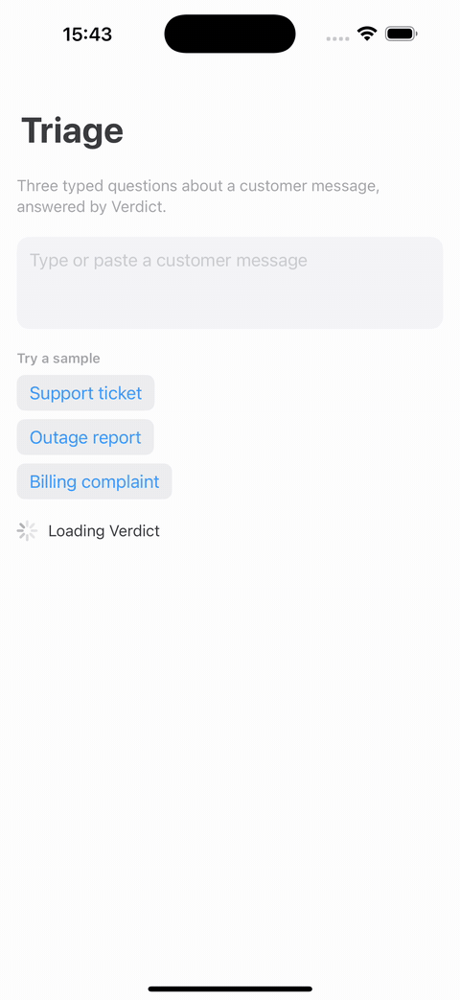

[English](README.md) | [简体中文](README.zh-CN.md) | [日本語](README.ja.md) | [한국어](README.ko.md) | [Español](README.es.md) | [Português](README.pt-BR.md)

# OpenJevSwift

[](https://github.com/Algorythm-Canada/OpenJevSwift/actions/workflows/ci.yml) [](https://github.com/Algorythm-Canada/OpenJevSwift/actions/workflows/fixtures.yml) [](https://github.com/Algorythm-Canada/OpenJevSwift/actions/workflows/docs.yml)

> Si esta traducción difiere del [README en inglés](README.md), prevalece la versión en inglés.

Hazle a un modelo preguntas tipadas sobre un fragmento de texto (sí o no, cuál de varias opciones, o cuánto en una
escala) y obtén probabilidades en lugar de texto generado. OpenJevSwift las responde localmente: en tu Mac, detrás de
una API HTTP compatible con Jev, o dentro de tu propia app para iPhone o Mac. Está pensado para desarrolladores de Swift
que quieren que estas decisiones se tomen en el dispositivo, y para usuarios de Mac que quieren la API de OpenJev en
un único binario nativo en lugar de un entorno de Python. La [app de demostración](#prueba-la-app-de-demostración) lo
muestra respondiendo mientras escribes.

Una implementación nativa en Swift de [OpenJev](https://github.com/razorback16/openjev), el servidor de decisiones
"System One" abierto y compatible con Jev. Envíale un estado y preguntas tipadas (`noul`, `choice`, `score`); lee cada
respuesta de las probabilidades de un modelo en lugar de generar texto, así que una respuesta no puede salirse del
esquema: la de un noul es la probabilidad de sí, y la de un choice o un score, la probabilidad de cada opción, con una
confianza. Un solo binario `openjev` sirve DiffusionGemma 26B-A4B o JevK5 sobre MLX, o Verdict o Laya sobre Core ML, en
un equipo Mac, con exactamente el mismo formato de peticiones y respuestas que upstream, así que los SDK de TypeSafe
funcionan con él sin cambios; las mismas bibliotecas responden peticiones dentro de una app para iPhone o Mac.

OpenJevSwift es un proyecto independiente. No está afiliado a TypeSafe AI (los creadores de Jev), a Google DeepMind o
NVIDIA (DiffusionGemma), ni a los autores de los demás modelos que sirve, ni cuenta con su respaldo. Jev, TypeSafe,
Gemma y otros nombres son propiedad de sus respectivos titulares.

## Inicio rápido

En un equipo Mac con Apple silicon, macOS 15 o posterior y Xcode 27 (el primer comando instala, una sola vez, el Metal
Toolchain de Xcode, como se explica en
[docs/development.md](docs/development.md#xcode-27-needs-the-metal-toolchain)):

```bash
xcodebuild -downloadComponent MetalToolchain
git clone https://github.com/Algorythm-Canada/OpenJevSwift.git
cd OpenJevSwift
swift build -c release --product openjev
.build/release/openjev serve --backend verdict
```

Con las versiones 26.4 a 26.6 de Xcode, añade `--build-system swiftbuild` a `swift build`; si no, a los backends `mlx` y
`jevk5` les faltan los shaders de Metal de MLX.

El primer arranque descarga el paquete Core ML convertido de Verdict, su tokenizador y su calibrador (unos 310 MB) en
Application Support y comprueba el SHA-256 de cada archivo; el servidor escucha en `127.0.0.1:8080` en cuanto el modelo
termina de cargarse y precalentarse. Desde otra terminal:

```bash
curl -s localhost:8080/v1/systemone -H 'content-type: application/json' \
    -d '{"model":"jev-latest","state":"The deploy failed twice and the site is down.","questions":{"urgent":{"type":"noul","instructions":"Is this urgent?"}}}'
```

```json
{"model":"verdict-1.4","answers":{"urgent":{"type":"noul","noul":0.5910340547561646}},"usage":{"input_tokens":45,"output_tokens":0}}
```

`openjev decide` responde a una petición sin servidor e imprime los bytes que envía el servidor:

```bash
echo '{"model":"jev-latest","state":"The deploy failed twice and the site is down.","questions":{"urgent":{"type":"noul","instructions":"Is this urgent?"}}}' | .build/release/openjev decide --backend verdict
```

Ctrl-C detiene el servidor de forma ordenada. [docs/deployment.md](docs/deployment.md) cubre la configuración, un
trabajo de launchd, los registros y los estados de salida.

Una app depende de una release y enlaza `OpenJevCore` y el módulo de cada backend que carga: `OpenJevEncoders` para
Verdict y Laya, `OpenJevDiffusionGemma` para DiffusionGemma y `OpenJevLetterReadout` para JevK5. El artículo de DocC
[Making decisions in an app](https://algorythm-canada.github.io/OpenJevSwift/documentation/openjevcore/gettingstarted/)
carga los mismos modelos dentro de una app:

```swift
dependencies: [
    .package(url: "https://github.com/Algorythm-Canada/OpenJevSwift.git", from: "0.1.0"),
],
targets: [
    .target(
        name: "MyApp",
        dependencies: [
            .product(name: "OpenJevCore", package: "OpenJevSwift"),
            .product(name: "OpenJevEncoders", package: "OpenJevSwift"),
        ]),
]
```

## Prueba la app de demostración



[Examples/TriageDemo](Examples/TriageDemo) es una app para iPhone que responde en el dispositivo al ejemplo del README
de upstream: si el mensaje de un cliente necesita respuesta en menos de una hora (`noul`), qué equipo debe atenderlo
(`choice`) y cuán molesto está el cliente (`score`), con la probabilidad de cada opción como una barra, mientras
escribes. Necesita Xcode 26.4 o posterior y un iPhone o un simulador con iOS 18 o posterior:

1. Cierra cualquier ventana de Xcode que tenga abierto el paquete OpenJevSwift: Xcode solo deja que una ventana use un
   paquete local.
2. Abre `Examples/TriageDemo/TriageDemo.xcodeproj`.
3. Para ejecutarla en un iPhone, elige tu equipo en Signing & Capabilities; el simulador no necesita ninguno.
4. Ejecuta el esquema `TriageDemo`.

El primer arranque descarga Verdict a través del propio almacén de la biblioteca, unos 310 MB desde la release
openjev-models y Hugging Face, y comprueba el SHA-256 de cada archivo; los arranques posteriores funcionan sin conexión.
[Examples/TriageDemo/README.md](Examples/TriageDemo/README.md) tiene los detalles y las pruebas.

## Requisitos

| Backend | Modelo | Mac | Memoria |
|---|---|---|---|
| `verdict` | `verdict-1.4`, 151M parámetros, Core ML | Apple silicon, macOS 15 o posterior | 1.6 GB con las funciones que cargan las lecturas de una sola pregunta, 2.8 GB con las seis |
| `laya` | `laya-1.0`, 421M parámetros, Core ML | Apple silicon, macOS 15 o posterior | 4.7 GB con las funciones que cargan las lecturas de una sola pregunta, 8.9 GB con las ocho y hasta 9.7 GB en el pico; con `OPENJEV_ENCODER_FUNCTIONS=2`, 2.1 GB para lecturas de una sola pregunta y hasta 4.4 GB en el pico |
| `mlx` | `openjev-0.1`, DiffusionGemma 26B-A4B, 4-bit, MLX | Apple silicon | unos 17 GB para cargar, incluidos los 1.06 GiB de la torre de visión (D-054); 17.3 GiB en servicio con prompts cortos, medidos antes de cargar la torre, y hasta unos 3.6 GB más para prompts largos en caché; se recomiendan 32 GB o más |
| `jevk5` | `jevk5-0.2`, JevK5 (Qwen3.5-4B), 8-bit, MLX | Apple silicon | 6.0 GB una vez cargado, hasta 11.0 GB en servicio con `OPENJEV_MLX_CACHE_LIMIT_GB=4`; 3.6 y 8.9 GB con la conversión de 4-bit |

Para compilar se necesita Xcode 26.4 o posterior. El backend `mlx` también necesita los shaders de Metal de MLX, que Swift
Build compila con el Metal Toolchain: Swift Build es el predeterminado con Xcode 27, y con Xcode 26 se pasa
`--build-system swiftbuild`. En una app, `OpenJevCore` funciona en macOS 14 e iOS 17 o posterior, los backends Verdict
y Laya en macOS 15 e iOS 18 o posterior, y JevK5 en Apple silicon (compila para iOS; todavía no se ha ejecutado en un
iPhone). En Linux se compilan el núcleo, el servidor y la herramienta `openjev` para las pruebas, sin ningún backend.

## Estado

La release 0.1.0 es la primera versión de la que puede depender un paquete; [CHANGELOG.md](CHANGELOG.md) enumera lo que
incluye. Hecho:

- **Hitos 0 a 5**, con todas sus issues de trabajo cerradas: los cimientos, el núcleo del motor de decisiones, las
  lecturas de DiffusionGemma sobre MLX, el servidor HTTP compatible con Jev con la herramienta `openjev`, las
  extensiones de lectura y las imágenes, y la generación de texto con `think` y chat completions (#50 a #53).
- **DiffusionGemma, verificado en su checkpoint:** `steps`, `samples` y `sequential` de extremo a extremo (#43, #44 y
  #45), y las lecturas de imágenes, que coinciden bit a bit con las de upstream en los kernels del oráculo (#46 a #48).
- **Del hito 6:** Verdict y Laya, y JevK5 (#55), que da la respuesta principal publicada por su autor en 230 de los 231
  ítems de JevBench (D-052).
- **Del hito 7:** la comparación de JevBench con upstream y el informe de calibración de DiffusionGemma (#61 y #62).

Pendiente:

- El modelo CLM, aplazado hasta que alguien lo pida
  ([D-011](docs/06-decisions.md#d-011-encoder-models-core-ml-for-verdict-and-laya-jevk5-first-among-the-extra-models)).
  Si lo necesitas, abre una [issue](https://github.com/Algorythm-Canada/OpenJevSwift/issues) o una publicación en
  [Discussions](https://github.com/Algorythm-Canada/OpenJevSwift/discussions) con tu caso de uso.
- Lecturas más rápidas de DiffusionGemma: #100, #101 y #102.

[docs/08-implementation-plan.md](docs/08-implementation-plan.md) tiene los hitos y el índice de issues.

## Compatibilidad

Aparte de las diferencias registradas, todo hasta las probabilidades del modelo es idéntico byte a byte a upstream: los
prompts, las plantillas de respuesta, los lienzos y las semillas, la validación de peticiones, los cuerpos de error,
las cabeceras y el listado de `/v1/models`, todo comprobado con fixtures que escribe el propio código de upstream. Las
probabilidades coinciden dentro de límites medidos:

- **DiffusionGemma:** dentro de los límites de las decisiones D-014 y D-048 en las 63 lecturas del oráculo (la
  etiqueta principal en el 91.7% de los slots, y en 139 de los 140 en los que las dos primeras etiquetas de mlx-vlm
  están separadas por al menos 0.5), y entre los dos servidores en 333 ítems de JevBench y TypeSafe.
- **Verdict y Laya:** la respuesta principal de upstream en todos los 666 ítems.
- **JevK5, en su conversión de 8-bit:** la respuesta principal publicada por su autor en 230 de los 231 ítems de
  JevBench, con los mismos recuentos de tokens en todos ellos.

Las diferencias, entre ellas un parser de JSON más estricto, el 503 ante cualquier fallo del backend y las funciones
aún no implementadas, tienen cada una un registro de decisión. [docs/compatibility.md](docs/compatibility.md) tiene
las tres tablas y la matriz de lo que funciona en macOS, iOS y Linux.

## Documentación

- **Documentación de la API.** Los catálogos DocC de `OpenJevCore`, `OpenJevEncoders`, `OpenJevDiffusionGemma`,
  `OpenJevLetterReadout` y `OpenJevServer`: primeros pasos en una app, los tipos de petición y de respuesta, cómo
  implementar un backend, cómo ejecutar el servidor y la referencia de configuración. El flujo de trabajo
  Documentation los compila cada vez que cambian las fuentes y los publica en
  <https://algorythm-canada.github.io/OpenJevSwift/>. `make docs` compila el mismo sitio localmente
  ([docs/development.md](docs/development.md)).
- **[docs/deployment.md](docs/deployment.md)**: cómo ejecutar `openjev serve` en un equipo Mac.
- **[docs/compatibility.md](docs/compatibility.md)**: qué es idéntico a upstream, qué está dentro de la tolerancia y
  qué es diferente.
- **[docs/credits.md](docs/credits.md)**: los modelos, sus autores y sus licencias.
- **[docs/quality.md](docs/quality.md)** y **[docs/benchmarks.md](docs/benchmarks.md)**: la calidad de las respuestas
  frente a upstream, y la velocidad y la memoria.
- **[docs/README.md](docs/README.md)**: el índice de los documentos de diseño, desde cómo funciona upstream hasta las
  decisiones y la estrategia de conformidad.
- **[CHANGELOG.md](CHANGELOG.md)**: cada release y la política de versionado.
- **[SECURITY.md](SECURITY.md)**: cómo informar de una vulnerabilidad, a qué se conecta el código y cómo maneja las
  claves.
- **[ADOPTERS.md](ADOPTERS.md)**: organizaciones que usan OpenJevSwift; añade la tuya con un pull request.

## Contribuir

Los informes de errores, los informes de compatibilidad, las correcciones de documentación y los pull requests son
bienvenidos, vengan de quien vengan. [CONTRIBUTING.md](CONTRIBUTING.md) explica cómo compilar, probar y abrir un pull
request. Las issues con la etiqueta
[help wanted](https://github.com/Algorythm-Canada/OpenJevSwift/labels/help%20wanted) están abiertas a cualquiera, y
[Discussions](https://github.com/Algorythm-Canada/OpenJevSwift/discussions) es el lugar para preguntas e ideas.

## Licencia y créditos

Apache-2.0, igual que el OpenJev de upstream. El código portado de mlx-vlm (MIT) conserva su aviso de copyright en la
cabecera de cada archivo; [THIRD_PARTY.md](THIRD_PARTY.md) enumera cada proyecto referenciado en su revisión fijada.
Los modelos son trabajo de otras personas y conservan sus propias licencias: [docs/credits.md](docs/credits.md) da
crédito a cada uno e indica de dónde obtiene este proyecto sus pesos. Ningún peso forma parte de este repositorio.
